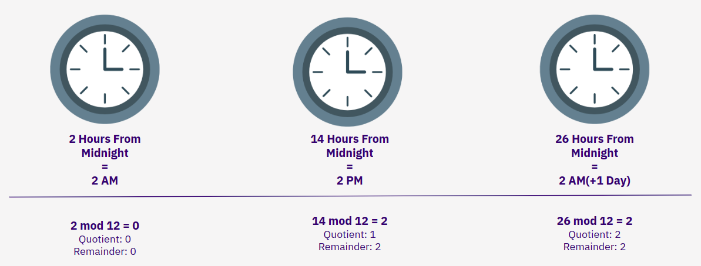

<div align="center">
    <h1>Camp 1: STARKS</h1>

|Presentation|Video|Workshop
|:----:|:----:|:----:|
|[STARKs](https://drive.google.com/file/d/1asONnOcSnRJwMXF-Zx1uJBdpbMrLYnmE/view?usp=sharing)|[Camp 1](https://www.youtube.com/watch?v=7p60e7RzuMs)|[STARK 101](https://starkware.co/stark-101)|

</div>

### Topics

<ol>
    <li>Modular Arithmetic</li>
    <li>Finite Field Arithmetic</li>
    <li>Polynomials</li>
    <li>ZK Terminology</li>
    <li>Computational Integrity</li>
    <li>STARKs</li>
    <li>STARKs vs SNARKs</li>
</ol>

<div align="center">
    <h2 id="modular_arithmetic">Modular Arithmetic</h2>
    <p>Un sistema de aritmética para números enteros donde los números "envuelven" cuando alcanzan un cierto valor (también conocido como 'módulo')</p>
    
</div>

Un ejemplo del mundo real de la aritmética modular es el cronometraje a través de un reloj. Cuando la hora del día excede el módulo (12), "envolvemos" y comenzamos en cero.

Ejemplo:

```bash
python3 finite_fields/python/modular_arithmetic.py
```

<h2 align="center" id="finite_fields">Finite Fields</h2>

Gran parte de la criptografía práctica actual se basa en "campos finitos". Un campo finito es un campo que contiene un número finito de elementos y define operaciones aritméticas de multiplicación, suma, resta y división. Estas operaciones aritméticas son.

Un campo finito no puede contener subcampos y, por lo tanto, normalmente implementa los principios de la aritmética modular sobre un número primo grande e irreducible. El número de elementos en el campo también se conoce como su "orden".

Ejemplo:

```bash
python3 finite_fields/python/finite_field_arithmetic.py
```

<h2 align="center" id="polynomials">Polynomials</h2>

`Polynomials` tienen propiedades que son muy útiles en [pruebas ZK](https://www.youtube.com/watch?v=iAaSQfZ-2AM). Un polinomio es una expresión de más de dos términos algebraicos. El grado de un polinomio es el grado más alto de cualquier término específico.

Para ver un ejemplo de cómo se pueden construir y expresar los polinomios en la ejecución del código:

```bash
python3 finite_fields/python/polynomial.py
```

<h2 align="center" id="zk_terminology">ZK Terminology</h2>

Los sistemas de prueba de conocimiento cero son sistemas de prueba en los que hay información secreta conocida por el "probador" que no es conocida por el "verificador", y el verificador todavía está convencido de la afirmación computacional.

Un sistema de prueba "no interactivo" es una máquina abstracta que modela el cálculo entre las dos partes (proveedor y verificador). Los mensajes se envían en [una dirección](https://www.youtube.com/watch?v=QJO3ROT-A4E) hasta que el verificador está convencido de la afirmación computacional.

Un sistema de prueba "sucinto" es aquel en el que el verificador puede ejecutar una orden de magnitud más rápido que una reejecución ingenua del programa.

`SNARKS`: Argumentos de conocimiento sucintos y no interactivos

`STARKs`: argumentos transparentes escalables de Knowled

<h2 align="center" id="computational_integrity">Computational Integrity</h2>

El objetivo de estos sistemas de prueba es demostrar la "integridad computacional" a un verificador. La integridad computacional se puede formalizar de la siguiente manera:

***Declaración de integridad computacional = (S0, P, T, S1)***

`S0`: Estado inicial
`P`: Programa que cambia de estado
`T`: Número de pasos
`S1`: Estado Final

<h2 align="center" id="starks">STARKs</h2>

`EN CONSTRUCCIÓN`:

Mientras se crea esta sección, recomendamos leer esta serie de publicaciones de blog ([1](https://medium.com/starkware/stark-math-the-journey-begins-51bd2b063c71), [2](https://medium .com/starkware/arithmetization-i-15c046390862), [3](https://medium.com/starkware/arithmetization-ii-403c3b3f4355)) sobre las matemáticas detrás de STARK.

<hr>

<h3>Arithmetization</h3>

<h4>Low Degree Extension</h4>

<h4>Polynomial Constraints</h4>

<h4>Commitment</h4>

<h3>FRI</h3>

<h4>Commitment</h4>

<h4>Queries</h4>

<h3>Proof</h3>

<hr>

#### Sources

[<https://eprint.iacr.org/2018/046.pdf>
, <https://vitalik.ca/general/2017/11/09/starks_part_1.html>
, <https://github.com/starkware-libs/ethSTARK>
, <https://consensys.net/blog/blockchain-explained/zero-knowledge-proofs-starks-vs-snarks/>
, <https://aszepieniec.github.io/stark-anatomy/>
, <https://github.com/elibensasson/libSTARK>
, <https://eprint.iacr.org/2021/582.pdf>]
