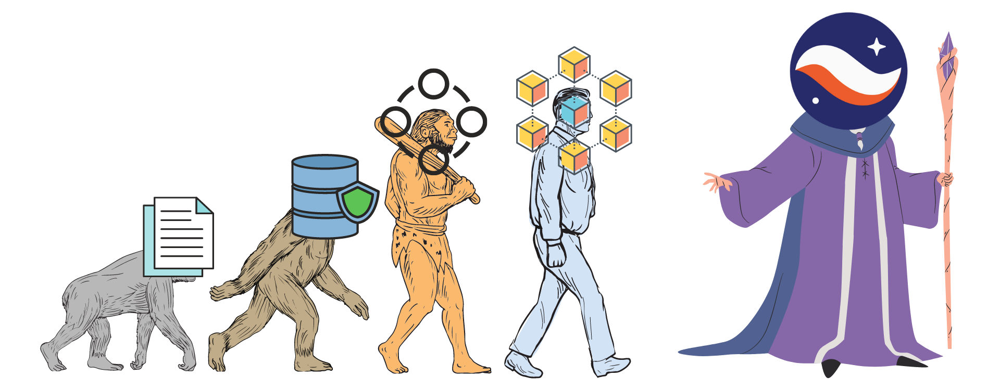
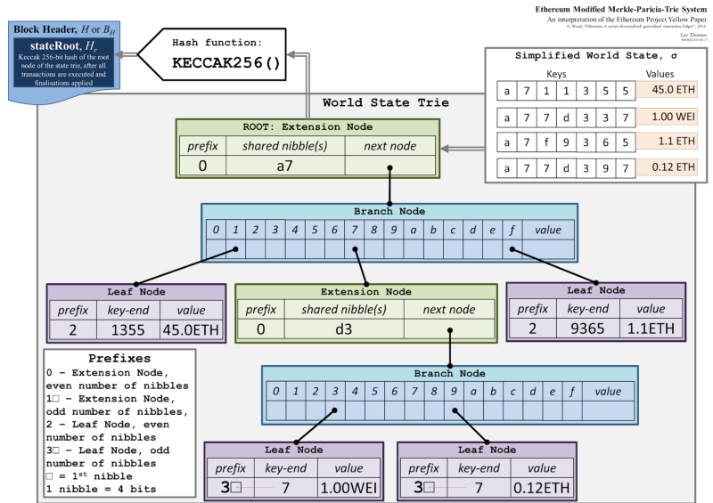

<div align="center">
    <h1>Primer</h1>

|Presentation|Video|Definitions
|:----:|:----:|:----:|
|[Validity Rollups](https://drive.google.com/file/d/1UqYi482bpVyXO4nWkogmIXq281q70f6y/view?usp=sharing)|[StarkNet 101](https://www.youtube.com/watch?v=DrBJ9LWvsOQ)|[Perama Blog](https://perama-v.github.io/cairo/description)
</div>

### Topics

1. [Bitcoin](./bitcoin/README.md)
2. [Smart Contracts](#smart_contracts)
3. [Ethereum](./ethereum/README.md)
4. [Rollups](./rollups/README.md)

<h2 align="center">Overview</h2>
Este manual está diseñado para cubrir los conceptos introductorios sobre lo que se construye en Cairo y StarkNet, y también para que se familiarice con el formato de este curso. Cada sección implicará profundizar en un concepto de alto nivel relacionado con StarkNet o Cairo hasta que lleguemos a un concepto "atómico" o irreducible que podamos representar en un ejemplo de código simple/ejecutable:


<div align="center">
    
</div>

Los ejemplos de código serán nombrados por el lenguaje de programación en el que se implementan, por ejemplo, la verificación de bloques de Bitcoin en [Golang](https://go.dev/doc/install) (si puede implementar estos ejemplos en otros idiomas, nos encantaría PR):

<div align="center">
    <a href="./bitcoin/block_verification/go">bitcoin/block_verification/go</a>
</div>

Los temas tratados en este manual han sido discutidos de cientos de maneras por miles de personas, por lo que, siempre que sea posible, me vincularé a esos recursos.

<div align="center">
    <em>De pie sobre los hombros de gigantes, bla, bla, bla, vamos a lo bueno</em>
</div>

<h3 align="center"> ¿Para que estamos resolviendo?</h3>
El advenimiento de la tecnología blockchain le ha dado al mundo sistemas computacionales con absoluta transparencia y responsabilidad inclusiva. Para obtener estas características, los sistemas de cadena de bloques se han visto obligados a realizar grandes compensaciones que afectan la usabilidad. Vitalik Buterin, resumió este problema en "The Blockchain Trilemma" afirmando:

<br>
<br>
<div align="center">
    <em>las cadenas de bloques se ven obligadas a hacer concesiones que les impiden ser descentralizadas, escalables y seguras.</em>
</div>
<br>

En este curso, aprenderá cómo StarkWare intenta abordar el Blockchain Trillemma y proporcionar un sistema que es inclusivamente responsable, descentralizado, escalable y seguro mediante el uso de pruebas STARK de conocimiento cero.

<p align="center">
    🎯
    <strong>Retos: </strong>
    Segura, inclusivamente responsable, descentralizada, escalable, expresiva
    🎯
</p>

<h2 align="center"> Evolución de la seguridad de los datos</h2>
<div align="center">
    
</div>

Para un ejemplo más concreto de trillemna, podemos movernos completamente fuera del contexto de la cadena de bloques. Digamos que Alice tiene un dato importante al que necesita acceder. Para empezar representaremos estos datos como caracteres ascii en formato YAML:

```yaml
alice_account: 5.00
```

Escribámoslo en un archivo en el disco de nuestra computadora y midamos el rendimiento:

```bash
time echo "alice_account: 5.00" >> bank.yaml
```

Leamos esa información:

```bash
time cat bank.yaml
```

Obviamente, es muy rápido leer y escribir estos datos desde nuestro disco local, y se pueden aplicar poderosos [mecanismos de base de datos](https://www.postgresql.org) para optimizar los accesos a los datos. PERO si deja caer su computadora o se acerca demasiado a un gran imán ACME, Alice pierde la valiosa información de su cuenta bancaria.
<p align="center">
    🎯
    <strong>Goals: </strong>
    <s style="color: red">secure</s>,
    <s style="color: red">inclusively accountable</s>,
    <s style="color: red">decentralized</s>,
    <span style="color: green">scalable</span>,
    <span style="color: green">expressive</span>
    🎯
</p>
<p align="center">
    💡
    <strong>Vamos a replicar la cuenta de Alice en otra computadora</strong>
    💡
</p>
Si replicamos el archivo YAML de la cuenta bancaria de Alice en varias computadoras, cuando una falla, ¡no hemos perdido los datos!

Preguntas del remitente:

- ¿Cómo ubico un host receptor al que enviar?
- ¿Cómo sé que el host receptor escribió con éxito los datos de la cuenta de Alice?
- Si cambio el valor de la cuenta de Alice, ¿cómo sabrá el host receptor que actualice el mismo valor?

Preguntas del receptor:

- ¿De quién recibiré datos?
- Si cambio el valor de la cuenta de Alice, ¿cómo sabrá el host de envío que debe actualizar el mismo valor?

### Sistemas distribuidos

Estas preguntas forman la base de los sistemas distribuidos y la computación distribuida a través de una red, y se han estudiado desde el inicio de Internet.

Veamos brevemente cómo una de las bases de datos distribuidas más populares [CassandraDB](https://cassandra.apache.org/doc/latest/cassandra/getting_started/configuring.html) maneja estos problemas.

Al configurar el sistema, puede ver que debe incluir en la lista blanca las direcciones IP del 'nodo semilla' que formarán nuestro clúster de confianza que participará en un [gossip](https://www.linkedin.com/pulse/gossip-protocol-inside-apache-cassandra-soham-saha) de igual a igual limitado. Aunque esto es adecuado para muchos sistemas tradicionales, nos esforzamos por construir sistemas inclusivos y sin permisos.

Una vez que se configura la base de datos distribuida, obtenemos "Tolerancia a fallas" para los valiosos datos bancarios de Alice. Si alguien trae accidentalmente su gran imán ACME a un centro de datos, se puede acceder fácilmente a los datos en hosts redundantes. De manera similar a las cadenas de bloques, estos sistemas distribuidos hicieron concesiones al ejemplo simple de I/O anterior. 

Entonces, ¿a qué renunciamos por esta tolerancia a fallas?

Perspectiva de los bancos:

- La sobrecarga de la red afecta el rendimiento
- La redundancia y la replicación afectan el rendimiento
- Mantenimiento de infraestructura ($$$$)

La perspectiva de Alicia:

- Delegados de confianza al banco:
  - la base de datos está configurada correctamente
  - la seguridad operativa puede manejar atacantes o intrusos
  - no está haciendo nada engañoso
  - etc.
- Los costos generalmente se pasan a Alice
<p align="center">
    🎯
    <strong>Goals: </strong>
    <span style="color: yellow">secure</span>,
    <s style="color: red">inclusively accountable</s>,
    <s style="color: red">decentralized</s>,
    <span style="color: green">scalable</span>,
    <span style="color: green">expressive</span>
    🎯
</p>
<p align="center">
    💡
    <strong>Vamos a replicar la cuenta de Alice en CUALQUIER computadora</strong>
    💡
</p>

### [Bitcoin](./bitcoin/README.md)

Bitcoin reúne varios conceptos informáticos junto con la [game theory](https://en.wikipedia.org/wiki/Game_theory) para crear una verdadera red peer-to-peer y niega la necesidad de delegar nuestra confianza en una parte central.

Los nodos confían en el productor de bloques en función de su [proof of work](./bitcoin/proof_of_work) y la red acuerda colectivamente un conjunto de actualizaciones canónicas del estado del libro mayor de Bitcoin y el estado de la cuenta de Alice.

```bash
# proof of work example
cd bitcoin/proof_of_work/go
go run main.go
```

Los propios nodos de Bitcoin escuchan y [validate](./bitcoin/block_verifcation) bloques de transacciones que el minero de ese bloque transmite a la red. Forman una estructura de datos llamada Merkle Tree para obtener un hash raíz correspondiente a todas las transacciones (y su orden) en ese bloque. Si un tx cambia incluso un solo bit, la raíz de Merkle será completamente diferente.

```bash
# block verification example
cd bitcoin/block_verification/go && go mod tidy
go run main.go utils.go
```

La información de Alice se formatea como [UTXO](https://en.wikipedia.org/wiki/Unspent_transaction_output) y se replica en todos los [nodos](https://bitnodes.io) en la red Bitcoin. Incluso puede validar que todo es exacto por sí misma repasando el árbol merkle de cada bloque de transacciones desde el génesis hasta ahora.
<p align="center">
    🎉
    <strong>NO DELEGATION OF TRUST</strong>
    🎉
</p>
Repasemos el trillema. ¿A qué renunciamos para obtener esta seguridad de datos sin confianza?

- Los mineros gastan energía mientras intentan obtener el nonce
- La verificación sin confianza completa requiere que CADA nodo replique el estado canónico:
   - hash el árbol merkle de transacciones
   - hash el encabezado del bloque

Tamaño de nodo completo: ~405 GB
  
Para una demostración ingenua de "La evolución de la seguridad de los datos", ejecute lo siguiente:
```bash
cd bitcoin/block_verification/go && go mod tidy
go test ./... -bench=. -count 5
```

<p align="center">
    🎯
    <strong>Goals: </strong>
    <span style="color: green">secure</span>,
    <span style="color: green">inclusively accountable</span>,
    <span style="color: green">decentralized</span>,
    <s style="color: red">scalable</s>,
    <s style="color: red">expressive</s>
    🎯
</p>
<p align="center">
    💡
    <strong>Dejemos que Alice use sus datos</strong>
    💡
</p>

<h2 align="center" id="smart_contracts">Smart Contracts</h2>

Los contratos inteligentes fueron propuestos por primera vez por [Nick Szabo](https://www.fon.hum.uva.nl/rob/Courses/InformationInSpeech/CDROM/Literature/LOTwinterschool2006/szabo.best.vwh.net/smart.contracts.html ) como un protocolo de transacción que ejecuta los términos de un contrato, brindando a todas las partes transparencia en el conjunto de reglas y la ejecución. Bitcoin facilita una versión limitada de [contratos inteligentes](https://ethereum.org/en/whitepaper/#scripting), pero el expresivo modelo de contrato inteligente de Ethereum se ha adoptado más ampliamente.
<h2 align="center">Ethereum</h2>

Ethereum proporciona una plataforma para implementar estos contratos inteligentes con el uso de la [Ethereum Virtual Machine](./ethereum/ethereum_virtual_machine). En el paradigma Ethereum, la información de la cuenta bancaria de Alice se almacena en una dirección de 20 bytes llamada [cuenta] (https://ethereum.org/en/whitepaper/#ethereum-accounts). El saldo de su cuenta junto con algunos campos más (nonce, storageRoot, codeHash) se convierten en un "nodo" en una estructura de datos llamada Patricia Trie, donde PATRICIA significa "Algoritmo práctico para recuperar información codificada en alfanumérico".

Este 'Trie' es un tipo específico de árbol que codifica una 'clave' como una ruta de prefijos comunes a su 'valor' correspondiente. Entonces, la cuenta bancaria de Alice se puede encontrar en una dirección ("clave") que apunta a una cuenta ("valor") en el estado mundial de Ethereum (trie). La estructura de árbol del trie nos permite obtener un hash criptográfico de cada nodo hasta un solo hash correspondiente a la "raíz" similar al árbol de Merkle que vimos en la verificación del bloque de Bitcoin.

Para ver un ejemplo de la estructura de datos MPT, puede usar este diagrama como referencia:

<div align="center">
    
</div>

y ejecuta lo siguiente:

```bash
cd ethereum/block_verification/go && go mod tidy
go run *.go
```

Luego, Ethereum propaga su estado al verificar que las transacciones estén bien formadas y aplicarlas a las cuentas. Alice tiene un par de claves pública/privada para administrar su "cuenta de propiedad externa" y puede firmar transacciones que involucren su saldo o impliquen interactuar con otros contratos en el estado.

Además de los EOA, Ethereum tiene "cuentas de contrato" que están controladas por el código de contrato asociado a ellas. Cada vez que la cuenta del contrato recibe un mensaje, el código de bytes que se almacena como un valor [codificado en RLP](https://eth.wiki/fundamentals/rlp) en el almacenamiento de la cuenta comienza a ejecutarse de acuerdo con las reglas de EVM.

Visita Trillemma: ¿a qué renunciamos para sumar expresividad?

- Cada transacción aún debe ser procesada por cada nodo de la red.
- Con la adición del almacenamiento de estado mundial, la cadena de bloques puede "inflarse", lo que lleva a un riesgo de centralización
- Alice puede pagar $100 para usar el dinero en su cuenta

Tamaño de nodo completo: ~700 GB

Tamaño del nodo de archivo: ~10 TB

<p align="center">
    🎯
    <strong>Goals: </strong>
    <span style="color: green">secure</span>,
    <span style="color: green">inclusively accountable</span>,
    <span style="color: green">decentralized</span>,
    <s style="color: red">scalable</s>,
    <span style="color: green">expressive</span>
    🎯
</p>
<p align="center">
    💡
    <strong>Optimicemos la utilidad de datos de Alice</strong>
    💡
</p>

<h2 align="center"> Rollups</h2>

A medida que aumenta la demanda de espacio en bloque, el costo de ejecución en la "Capa 1" (protocolos de consenso total, por ejemplo, Bitcoin, Ethereum) será cada vez más costoso, y hasta ciertos [state expiry mechanisms](https://notes.ethereum.org/@vbuterin/verkle_and_state_expiry_proposal) se implementan y podemos esperar que el estado de la L1 continúe aumentando con el tiempo. Esto requerirá una máquina cada vez más robusta para mantener el estado y posteriormente verificar los bloques.

Los rollups son una solución en la que la lógica empresarial se ejecuta y almacena en un protocolo fuera del contexto de Ethereum y luego demuestra su ejecución exitosa en el contexto de Ethereum.

Por lo general, esto implica comprimir una mayor cantidad de transacciones en esta "Capa 2" y comprometer las diferencias de estado en un contrato inteligente implementado en L1.
Para una interoperabilidad total con los paquetes acumulativos L1, también suele implementar un componente de mensajería para depósitos y retiros.

Actualmente hay dos tipos de acumulaciones que se están adoptando ampliamente:

- Paquetes acumulativos optimistas
- Paquetes acumulativos de conocimiento cero

Vitalik proporciona una buena comparación de los dos [aquí](https://vitalik.ca/general/2021/01/05/rollup.html#optimistic-rollups-vs-zk-rollups), y toca las piezas finales de nuestro largo
viaje del trilema:

***No importa cuán grande sea el cálculo, la prueba se puede verificar muy rápidamente en la cadena.***

Esto le permite a Alice mover su dinero libremente entre L1 y L2 (... pronto será L3) y operar en una capa expresiva de cadena de bloques de bajo costo.
¡Todo mientras hereda la forma más alta de evolución de seguridad de datos de L1 y no tiene que delegar la confianza a ninguna parte centralizada!

<p align="center">
    🎯
    <strong>Goals: </strong>
    <span style="color: green">secure</span>,
    <span style="color: green">inclusively accountable</span>,
    <span style="color: green">decentralized</span>,
    <span style="color: green">scalable</span>,
    <span style="color: green">expressive</span>
    🎯
</p>

<p align="center">
    🎉🎉🎉🎉🎉🎉🎉🎉🎉🎉🎉🎉🎉🎉🎉🎉🎉🎉🎉🎉🎉🎉🎉🎉🎉🎉🎉🎉🎉🎉🎉🎉🎉🎉🎉🎉🎉🎉🎉🎉🎉🎉🎉🎉🎉🎉🎉🎉🎉🎉🎉🎉🎉🎉
</p>
